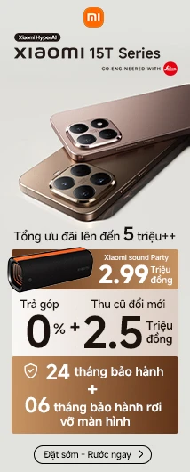

    <!-- <main class="d-flex gap-3" style="height: fit-content; margin-top: 1rem;">
    		

    			

    				

    					
    				

    				

    					
    				

    			

    			

    				

    					<h1 class="fs-3 text-start px-1 mt-2 pb-2">Sản phẩm nổi bật</h1>
    					<a href="" class="d-flex gap-1 align-items-center text-primary p-2 rounded-3 loadmore_btn">Xem tất cả
    						<svg stroke="currentColor" fill="currentColor" stroke-width="0" viewBox="0 0 512 512" class="ml-1 inline size-4" height="1em" width="1em" xmlns="http://www.w3.org/2000/svg"><path fill="none" stroke-linecap="round" stroke-linejoin="round" stroke-width="48" d="m184 112 144 144-144 144"></path></svg>
    					</a>
    				

    				

    				

    					<h1 class="fs-3 text-start px-1 mt-2 pb-2">Sản phẩm Laptop</h1>
    					<a href="" class="d-flex gap-1 align-items-center text-primary p-2 rounded-3 loadmore_btn">Xem tất cả
    						<svg stroke="currentColor" fill="currentColor" stroke-width="0" viewBox="0 0 512 512" class="ml-1 inline size-4" height="1em" width="1em" xmlns="http://www.w3.org/2000/svg"><path fill="none" stroke-linecap="round" stroke-linejoin="round" stroke-width="48" d="m184 112 144 144-144 144"></path></svg>
    					</a>
    				

    				

    				

    					<h1 class="fs-3 text-start px-1 mt-2 pb-2">Sản phẩm điện thoại</h1>
    					<a href="" class="d-flex gap-1 align-items-center text-primary p-2 rounded-3 loadmore_btn">Xem tất cả
    						<svg stroke="currentColor" fill="currentColor" stroke-width="0" viewBox="0 0 512 512" class="ml-1 inline size-4" height="1em" width="1em" xmlns="http://www.w3.org/2000/svg"><path fill="none" stroke-linecap="round" stroke-linejoin="round" stroke-width="48" d="m184 112 144 144-144 144"></path></svg>
    					</a>
    				

    				

    			

    		

    	</main> -->
